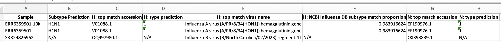
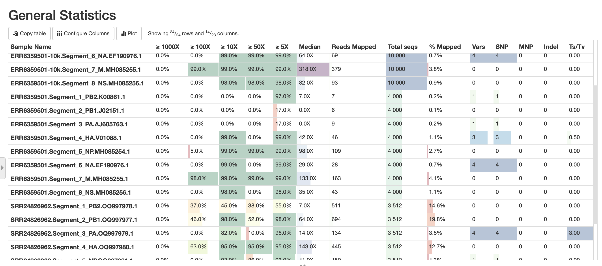

# nf-flu Pipeline Tutorial

### Introduction
The `nf-flu` pipeline, developed by CFIA-NCFAD, is a Nextflow bioinformatics analysis pipeline designed for assembly and H/N subtyping of Influenza A and B viruses from Illumina or Nanopore sequencing data. This pipeline automates the process of selecting the top matching reference sequence for each of the 8 gene segments of Influenza from NCBI, based on IRMA assembly and nucleotide BLAST. It supports both custom and NCBI reference sequences.

#### Pipeline Summary
1. Download NCBI Orthomyxoviridae sequences and metadata.
2. Merge reads of re-sequenced samples if needed.
3. Assembly of Influenza gene segments with IRMA.
4. Nucleotide BLAST search against NCBI Influenza database sequences.
5. H/N subtype prediction and report generation based on BLAST results.
6. Select top match reference sequences for segments.
7. Read mapping, variant calling, and consensus sequence generation for each segment.
8. MultiQC report generation.


### Quick Start
Let's first test to see if the pipeline is working

For Illumina:

```bash
nextflow run CFIA-NCFAD/nf-flu -profile test_illumina,docker --max_cpus 2
```

For Nanopore:

```bash
nextflow run CFIA-NCFAD/nf-flu -profile test_nanopore,docker --max_cpus 2
```

### Pipeline output

There is excellent documentation on the output of the pipeline, so I will direct you there rather than repeat most of it here:
https://github.com/peterk87/nf-flu/blob/master/docs/output.md

#### 1. Summary report: nf-flu-subtyping-report.xlsx

- gives summary of all findings
- H and N Subtyping of all samples



#### 2. Multiqc report

- graphical summary of many stats
- typically per segment per sample


#### 3. Conesnsus genomes
- Found in the `conensus` folder
- `irma` contains the de-novo assembly consensus genomes
- `bcftools` contains the reference-based (mapping) consensus genomes 


### Running the pipeline

#### 1. Copy the make_samplesheet.py script
- 