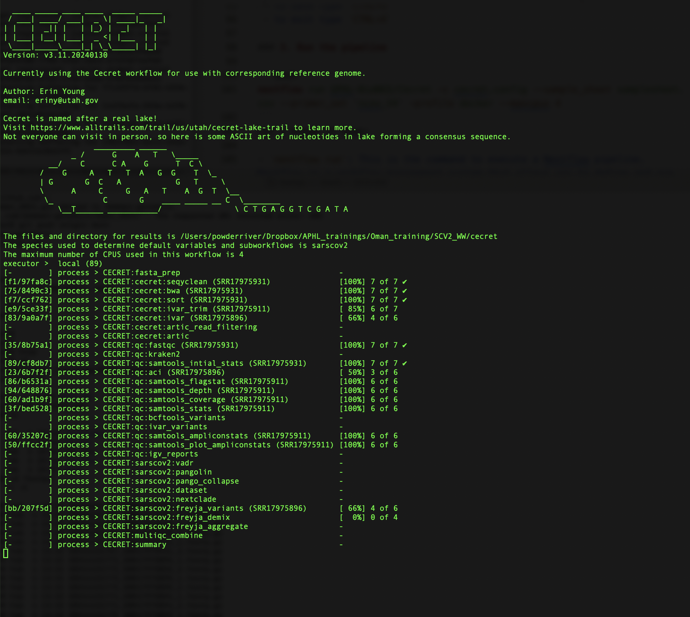

# Running the Cecret Pipeline for Wastewater Surveillance for SARS-CoV-2

## Introduction
**Cecret** is a comprehensive bioinformatics pipeline developed by the Utah Public Health Laboratory for SARS-CoV-2 sequencing, with flexibility for additional organisms and primer schemes. It was originally designed for Illumina data but has since expanded to accommodate other sequencing platforms. This tutorial will guide you through setting up and running the Cecret pipeline.

You can find all the details here: https://github.com/UPHL-BioNGS/Cecret 

## Prerequisites
`Nextflow`: Cecret is built on `Nextflow`, a workflow tool that simplifies the execution of complex bioinformatics pipelines. Make sure you have `Nextflow` installed by following the instructions here.

```bash
mamba install -c bioconda nextflow
```

You can make sure Nextflow is up-to-date by running:

```bash
mamba update nextflow
```

**Containerization Platform:** Cecret supports both Docker and Singularity. Choose one based on your environment.

## Usage
The basic usage of Cecret is like most nexflow pipelines:

```bash
# Using Singularity with paired-end reads in a directory called 'reads'
nextflow run UPHL-BioNGS/Cecret -profile singularity --reads <directory to reads>

# Using Docker with samples specified in SampleSheet.csv
nextflow run UPHL-BioNGS/Cecret -profile docker --sample_sheet SampleSheet.csv

# Using a config file containing all inputs
nextflow run UPHL-BioNGS/Cecret -c file.config

```

## Samplesheet format
Cecret can utilize a sample sheet for input, with the sample name and reads separated by commas. The header must be `sample,fastq_1,fastq_2`, and rows match files with their processing needs.

Example sample sheet:
```bash
sample,fastq_1,fastq_2
SRR13957125,/path/to/reads/SRR13957125_1.fastq.gz,/path/to/reads/SRR13957125_2.fastq.gz
SRR13957170,/path/to/reads/SRR13957170_1.fastq.gz,/path/to/reads/SRR13957170_2.fastq.gz
```
## Let's try it out!!

### 1. Make samplesheet

We have data in the `Oman_training/SCV2_WW` folder. Make sure we are in this folder by using the `cd` command. 

There are fastq files from an actual wastewater data in the `fastqs` folder. We can use a for-loop to quickly create out samplesheet in the right format:

```bash
for fastq_file in fastqs/*_1.fastq.gz; do 
    sample_name=$(basename "$fastq_file" | sed 's/_1.fastq.gz//'); 
    read1="$fastq_file"; 
    read2="${fastq_file/_1.fastq.gz/_2.fastq.gz}"; 
    echo "$sample_name,$read1,$read2" >> samplesheet.csv; 
    done
```
- This line starts a for loop that iterates over all files in the `fastqs` directory whose names match the pattern `*_1.fastq.gz`. This pattern will match any file in the `fastqs` directory ending with `"_1.fastq.gz"`.

- `basename "$fastq_file"` extracts the base name of the file, removing the directory path. For example, if fastq_file is `fastqs/SRR17975893_1.fastq.gz`, `basename` will return `SRR17975893_1.fastq.gz`.

- `sed 's/_1.fastq.gz//'` then uses the sed command to remove the "_1.fastq.gz" suffix from the extracted filename, leaving just the sample name. In this case, it would return `SRR17975893`.

We need to add the header line to the `samplesheet.csv` so it is in the proper format:
```
sed -i '1s/^/sample,fastq_1,fastq_2\n/' samplesheet.csv
```

You can also write it yourself by simply typing `nano samplesheet.csv`


### 2. Prepare config file for running wastewater samples 
The Cecret documentation says to turn a few tools on and off for running wastewater samples: 

```
params.species           = 'sarscov2' //this is the default, but it is required for the subworkflow that involves freyja
params.bcftools_variants = false
params.ivar_variants     = false
params.pangolin          = false
params.nextclade         = false
params.vadr              = false
```

We need to make a config file for nextflow using exactly this.

I would suggest just copy and pasting this into a file using `nano`:

`nano WW_options.config`
 - paste in the above paramaters. 
 - to save type `CTRL+O`
 - to exit type `CTRL+X`

### 3. Run the pipeline

```bash
nextflow run UPHL-BioNGS/Cecret -c cecret.config --sample_sheet samplesheet.csv --primer_set 'ncov_V4' -profile docker --maxcpus 4
```
Let's break it down:

- `nextflow run`: This is the command to execute a Nextflow pipeline. Nextflow is a workflow management system that allows you to define and run complex data analysis pipelines.

- `UPHL-BioNGS/Cecret`: This is the name of the Nextflow pipeline that you want to run. It refers to a specific pipeline defined in the repository `UPHL-BioNGS/Cecret`.

- `-c cecret.config`: This flag specifies the configuration file to use for the pipeline. The `cecret.config` file contains various settings and parameters that control the behavior of the pipeline.

- `--sample_sheet samplesheet.csv`: This flag specifies the sample sheet file to use for the pipeline. 

- `--primer_set 'ncov_V4'`: This flag specifies the primer set to use for the pipeline. Our practice data was generated using the ARTIC v4 primers.

- `-profile docker`: This flag specifies the execution profile to use for the pipeline. The docker profile means that the pipeline will be executed within Docker containers. You can also choose `singularity` as an option.

- `--maxcpus 4`: This flag specifies the maximum number of CPUs to use for the pipeline. By specifying this flag with a value of 4, you are telling the pipeline to use a maximum of 4 CPUs for parallel execution. You can set this higher!!


**You should see something like the following:**
