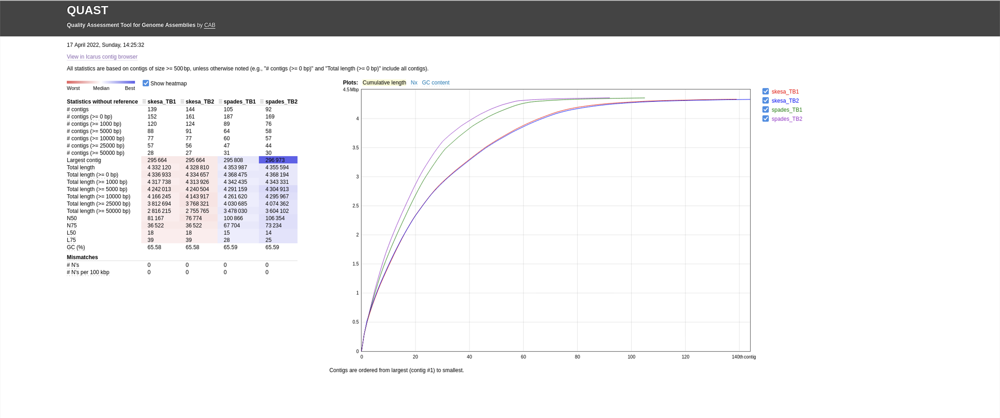
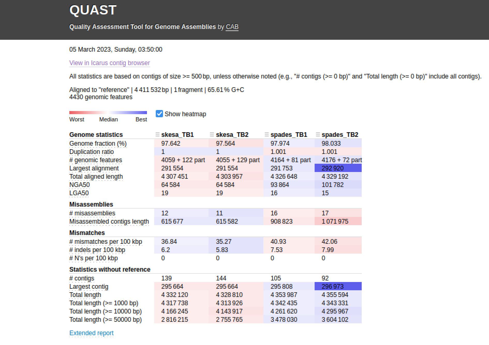
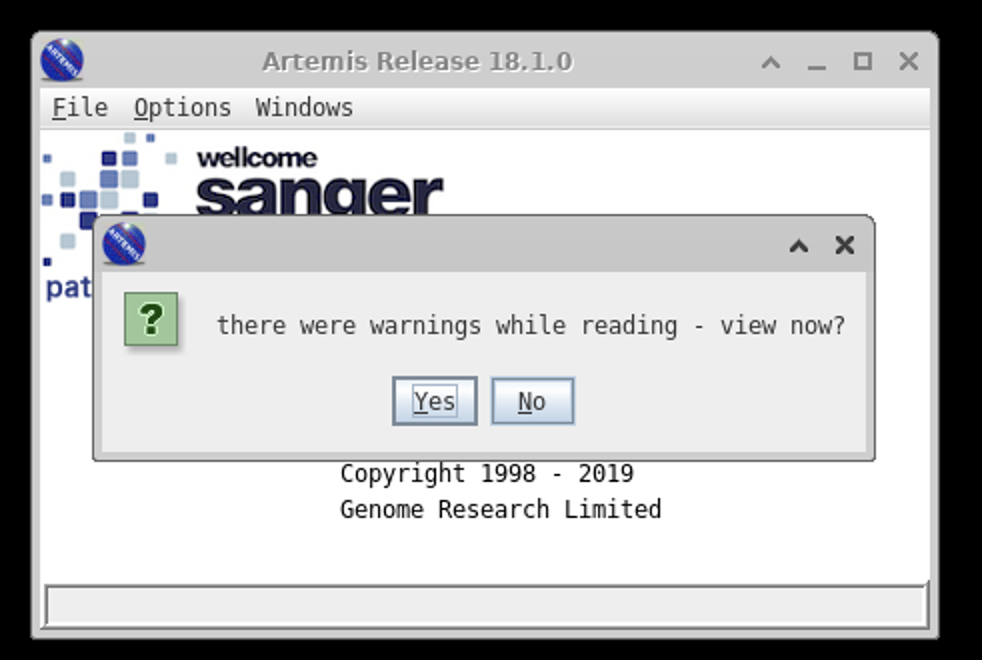
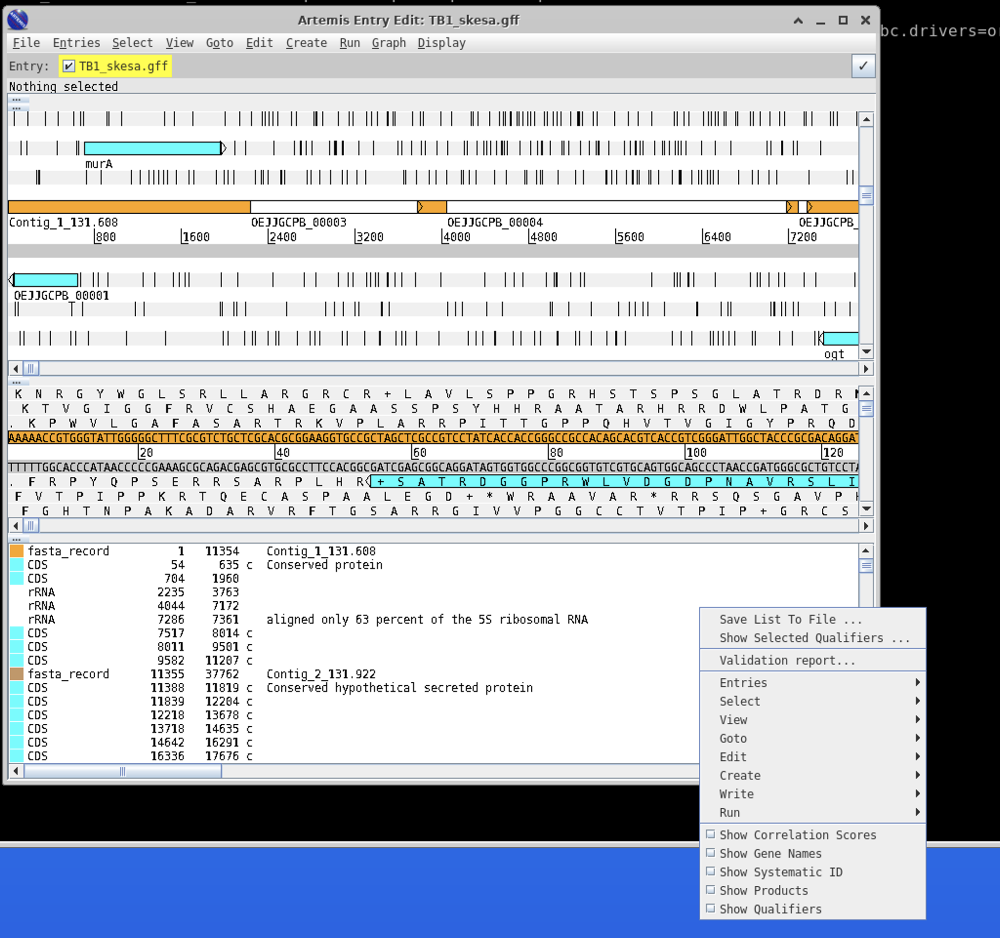
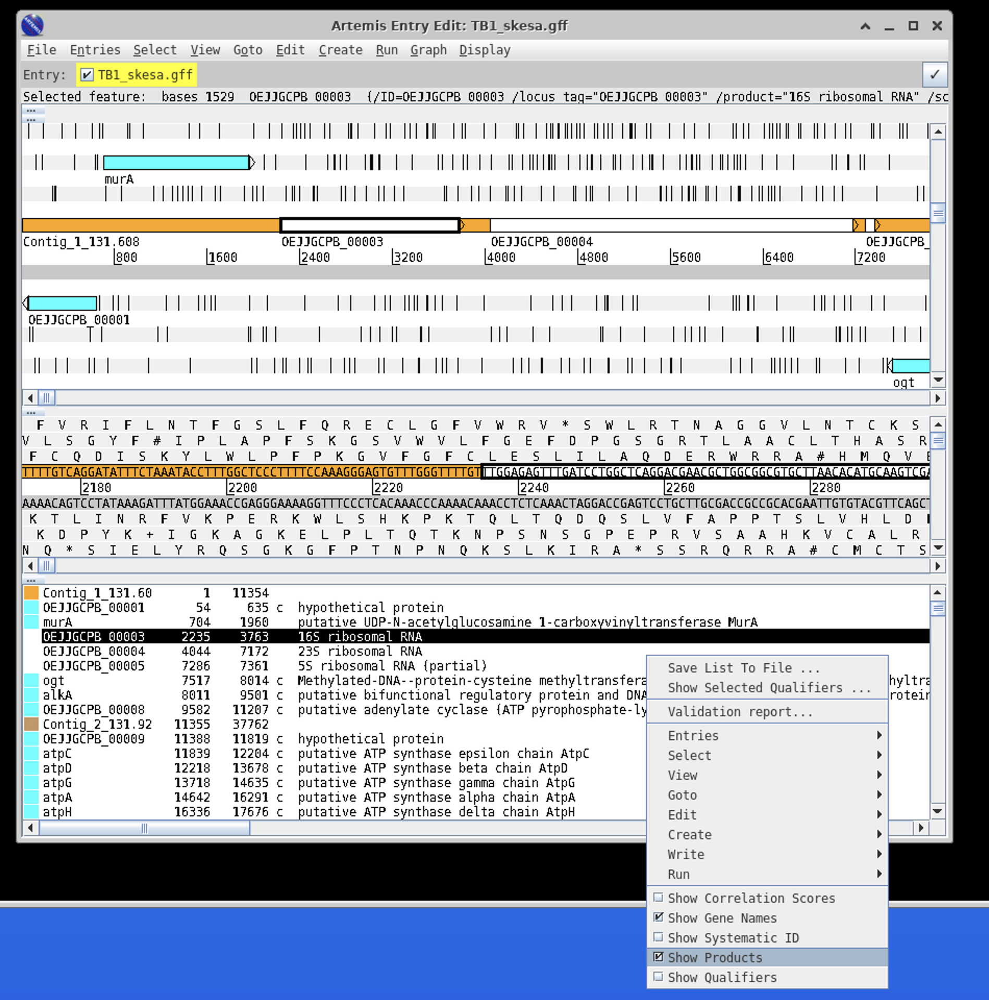
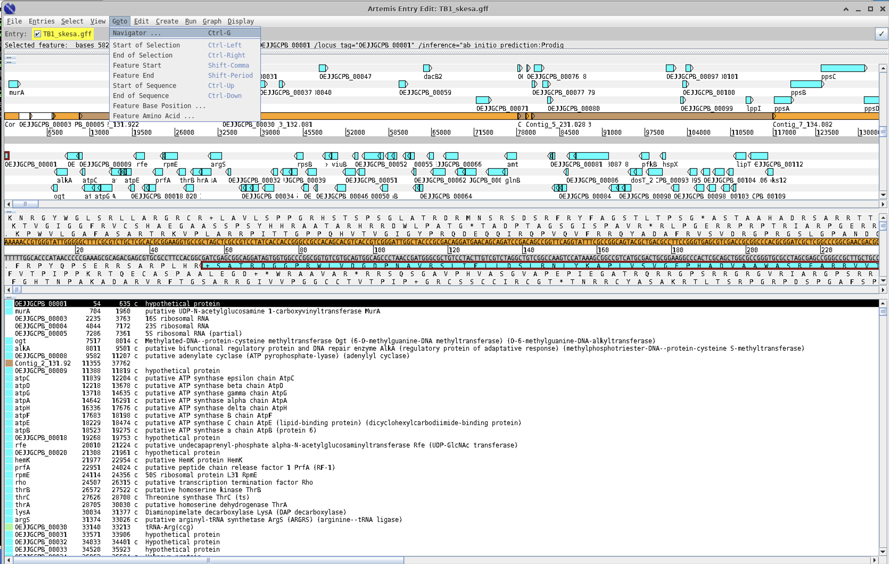
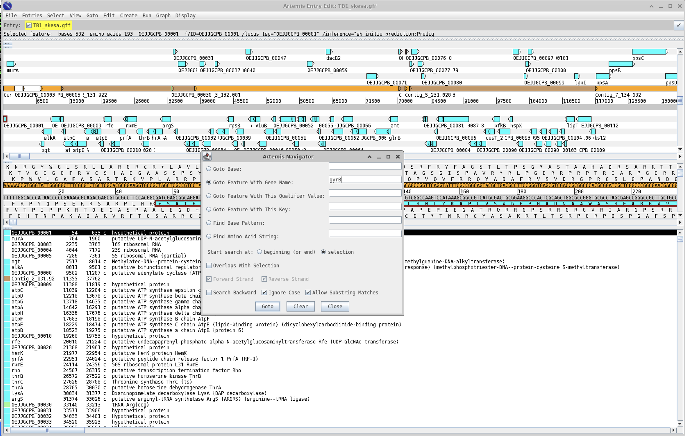

# Bacterial genome assembly and annotation using Mycobacterium tuberculosis example dataset


## Table of contents
1. [Introduction & Aims](#introduction)
2. [Run Quast](#exercise1)
3. [Looking at genomes](#exercise2)
4. [Commands for running assemblies](#exercise3)

## 1. Introduction <a name="introduction"></a>
Genome assembly involves piecing together short fragments of DNA sequence (called reads) into longer contiguous sequences (called contigs) or scaffolds to reconstruct the original genome. This is typically done when a reference genome is not available or when there are significant differences between the genome being studied and the available reference genome. In genome assembly, the reads are analyzed de novo, without relying on a pre-existing reference genome. As a result, genome assembly can provide a more comprehensive view of the genome, including regions that may be absent or divergent in the reference genome.

**SPAdes** (St. Petersburg genome assembler) is a popular genome assembly software that is commonly used for bacterial genome assembly. SPAdes works by building de Bruijn graphs from the sequencing reads, and then using these graphs to assemble the genome into contigs (short, contiguous sequences of DNA).  

**SKESA** (Shovill-Kraken-Excise-Scaffolding-Alignment) is another popular bacterial genome assembly tool that is gaining in popularity due to its speed and accuracy. SKESA is a hybrid assembler that uses both de Bruijn graph and overlap-layout-consensus (OLC) algorithms to assemble the genome.  

In this module, we will look at assemblies of our two *M. tuberculosis* datasets that we have been working with. We will then annotate these assemblies using a tool called `prokka`.

### We will

- [X] Compare assembly methods using `quast`
- [X] Use `prokka` to annotate genomes
- [x] Learn the assembly commands for SKESA and Spades


## Compare assemblies using Quast <a name="exercise1"></a>
First move into the TB dataset assemblies folder:
```bash
cd ~/modules/assemblies
```
As the bacterial assembly steps can take quite a while, we have provided the completed assemblies here for us to examine. You will find the commands used to generate these assemblies at the end of the module.

## 1. Run quast on our assemblies:

Quast usage is as follows:
`quast [options] <contig files>`

Contig files are the `.fasta` or `.fa` files produced by assembly programs   

```bash
quast -l skesa_TB1,skesa_TB2,spades_TB1,spades_TB2 skesa_TBsample1.fasta skesa_TBsample2.fasta spades_TBsample1_contigs.fa spades_TBsample2_contigs.fa
```

`-l` : you can rename what the assembly dataset is called here. We do this to make it easier when we are looking at the results instead of long names  

#### **Use firefox to look at the output files:
```bash
firefox quast_results/latest/report.html
```

There are a number of useful metrics reported by Quast on each assembly:
1. Total number of contigs
2. Largest contig
3. Total length of the assembly
4. N50 value : the length of the shortest contig for which longer and equal length contigs cover at least 50 % of the assembly

#### Compare the SKESA versus Spades assemblies for TB1 and TB2 datasets.
***Questions***
1. For each dataset (TB1 and TB2), which assembler produces more contigs?
2. For each dataset (TB1 and TB2), what is the size difference between the assemblies?
3. Do you notice a trend between the assemblers?




## 2. Run quast using a reference genome 

Comparing our assemblies against the reference genome can give more insight into the differences between the assemblies.
```bash
quast -r reference.fa -g reference.gff -l skesa_TB1,skesa_TB2,spades_TB1,spades_TB2 skesa_TBsample1.fasta skesa_TBsample2.fasta spades_TBsample1_contigs.fa spades_TBsample2_contigs.fa

firefox quast_results/latest/report.html
```
Quast now provides some additional information when we compare to our reference genome. 



You can hover over each of the reported statistics to see a description. 

***Questions***
1. Are our genomes complete compared to the reference? (Check Genome fraction)
2. Which assemblies have the most identified misassemblies?
3. Do you notice a trend between the assemblers?

`SKESA` tends to be more conservative and produces more accurate assemblies, but the assembly is more fragmented (ie more contigs). `Spades` tends to produce longer contigs, but this comes at a cost of sometimes misassembling. 

## 3. Genome annotation with `prokka` <a name="exercise2"></a>
`Prokka` is a software tool used for rapid and automated annotation of bacterial and archaeal genomes. It is designed to be user-friendly, with a simple command-line interface, and is capable of producing rich annotation output in a range of standard formats.

The `Prokka` annotation pipeline involves several steps. First, it predicts the coding sequences (CDSs) in the genome using a combination of ab initio gene prediction and homology-based methods. It also predicts non-coding RNAs (ncRNAs), transfer RNAs (tRNAs), and ribosomal RNAs (rRNAs). Next, it annotates the predicted CDSs and other features with functional information, including gene names, product descriptions, EC numbers, and Gene Ontology (GO) terms, using a range of external databases and tools. Finally, it generates summary statistics and output files in various formats, including GenBank, GFF, and EMBL.


`Prokka` is a very popular (probably the most) bacterial annotation tool. You can read more about it here : https://github.com/tseemann/prokka


#### First we need to create a new environment and install `prokka`:
```bash
mamba create -n annotate -c conda-forge -c bioconda -c defaults prokka   
conda activate annotate
```

#### Now run `prokka`
```bash
prokka --cpus 4 --proteins ../TB_module/Mtb_H37Rv.gb --outdir skesa_TB1 --prefix TB1_skesa skesa_TBsample1.fasta  

prokka --cpus 4 --proteins ../TB_module/Mtb_H37Rv.gb --outdir skesa_TB2 --prefix TB2_skesa skesa_TBsample2.fasta
```
In this command:

`--cpus` specify the number of cores  
`--proteins` uses the annotations from the reference genome  
`--outdir` specifies the output directory where Prokka will write its results.  
`--prefix` changes the output file name (default is full input file name)   
The last position in the command is our input fasta file (our assembly)


#### There are many output files produced by prokka:
#### Output Files

| Extension | Description |
| --------- | ----------- |
| .gff | This is the master annotation in GFF3 format, containing both sequences and annotations. It can be viewed directly in Artemis or IGV. |
| .gbk | This is a standard Genbank file derived from the master .gff. If the input to prokka was a multi-FASTA, then this will be a multi-Genbank, with one record for each sequence. |
| .fna | Nucleotide FASTA file of the input contig sequences. |
| .faa | Protein FASTA file of the translated CDS sequences. |
| .ffn | Nucleotide FASTA file of all the prediction transcripts (CDS, rRNA, tRNA, tmRNA, misc_RNA) |
| .sqn | An ASN1 format "Sequin" file for submission to Genbank. It needs to be edited to set the correct taxonomy, authors, related publication etc. |
| .fsa | Nucleotide FASTA file of the input contig sequences, used by "tbl2asn" to create the .sqn file. It is mostly the same as the .fna file, but with extra Sequin tags in the sequence description lines. |
| .tbl | Feature Table file, used by "tbl2asn" to create the .sqn file. |
| .err | Unacceptable annotations - the NCBI discrepancy report. |
| .log | Contains all the output that Prokka produced during its run. This is a record of what settings you used, even if the --quiet option was enabled. |
| .txt | Statistics relating to the annotated features found. |
| .tsv | Tab-separated file of all features: locus_tag,ftype,len_bp,gene,EC_number,COG,product |


### The GenBank `.gbk` file is one of the main outputs that is useful for downstream applications, as is the `.gff` file.


## 4. Viewing assemblies in genome browser

You can take an interactive look at your genomes by using one of several interactive genome browsers. My personal favorite is `artemis`, but another popular one is `IGV`.

You can load your annotated genome for viewing in Artemis like so:
```bash
art skesa_TB1/TB1_skesa.gff
```
When you first start this up an annoying box will appear telling you Artemis is complaining about something and that there are warnings. In this case hit the `NO` button.



You should now be on the main screen.

A few things are helpful when browsing. Right click in the white area to the right on the bottom panel to bring up the following menu:


Click Show Gene Names and Show Products


A very useful tool is the navigation pane within Artemis.


For instance, if we wanted to find the `gyrB` gene you can search for it as follows:



For more details on using Artemis: https://github.com/domman-genomics/WWPG_2022/blob/main/manuals/module_artemis/module_artemis.md


# 5. Commands for running bacterial genome assembly <a name="exercise3"></a>

## You do **not** need to run these commands! They are here for informational purposes.

Two very popular bacterial genome assembly programs are `SKESA` and `Spdaes`. A popular pipeline for running spades assemblies is called `shovill` which is what we are using here.

You can find more information here:  

`SKESA` : https://github.com/ncbi/SKESA  
`Shovill` : https://github.com/tseemann/shovill

#### First we install the programs in a new conda environment:
```bash
mamba create -n assembly -c bioconda -c conda-forge skesa shovill   
conda activate assembly
```
#### Run the `skesa` assembler : ~20 minutes per dataset
```bash
skesa --reads TBsample1_1_val_1.fq.gz,TBsample1_2_val_2.fq.gz --cores 4 --memory 8 > skesa_TBsample1.fasta   
skesa --reads TBsample2_1_val_1.fq.gz,TBsample2_2_val_2.fq.gz --cores 4 --memory 8 > skesa_TBsample2.fasta
```

#### Run `shovill` aka `spades` assembler : ~35 minutes per dataset
```bash
shovill --outdir spades_TBsample1 --R1 TBsample1_1_val_1.fq.gz --R2 TBsample1_2_val_2.fq.gz   
shovill --outdir spades_TBsample2 --R1 TBsample2_1_val_1.fq.gz --R2 TBsample2_2_val_2.fq.gz
```
