# SARS-CoV-2 ARTIC pipeline with Nanopore data
## Table of contents
1. [Introduction & Aims](#introduction)
2. [Install ARTIC](#exercise1)
3. [Using `tar`](#exercise2)
4. [Running ARTIC pipeline](#exercise3)
5. [Looking at reads with IGV](#exercise4)

## 1. Introduction <a name="introduction"></a>

In this module, we are going to work through how to generate SARS-CoV-2 consensus genomes from  Oxford Nanopore data. The most popular pipeline for this is called ARTIC.

You can find more information here:  
`ARTIC` : https://github.com/artic-network/fieldbioinformatics


This data was generated by sequencing on an ONT GridION using Midnight V1200 primer scheme. Because ONT can produce much longer reads, the amplicon size can greatly be increased on these devices.

See more in comparison with the V4 scheme here : https://nanoporetech.com/covid-19  

## **1. First go to the Nanopore directory:**

```bash
cd ~/modules/SARS_CoV-2/Nanopore_data
```


#### **Load the ARTIC Bioinformatics conda env** <a name="exercise1"></a>
A very popular pipeline for processing SARS-CoV-2 nanopore sequencing data is ARTIC. They put out an SOP for running the pipeline back in 2020, and it is still quite useful to follow:

https://artic.network/ncov-2019/ncov2019-bioinformatics-sop.html   


We will need to load the `artic-ncov2019` conda environment here:
```bash
conda activate artic-ncov2019
```

## 2.  Using `tar` to uncompress folders<a name="exercise2"></a>

####  to use `tar` to uncompress the files:
```bash
ll
```
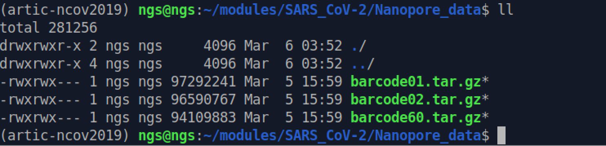
You will see that there are three barcode files that end in `.tar.gz`. This means these are folders that are gzipped (.gz) or compressed. We need to uncompress them for us to use them.   
 

#### Use `tar` to uncompress:

```
tar xzvf barcode01.tar.gz
ll
```
`tar [options] [compressed-file] [file or directory to be compressed]` :  
`-x` : Extract (decompress)  
`-c` : compress  
`-z` : zip, tells tar command to create or uncompress tar file using gzip  
`-v` : Displays Verbose Information (print what is happening to the screen)  
`-f` : creates archive with given filename


`tar xzvf [compressed file]` is standard way to uncompress  

To compress a folder use similar command:   
`tar czvf [<file_name>.tar.gz] [file or folder]`


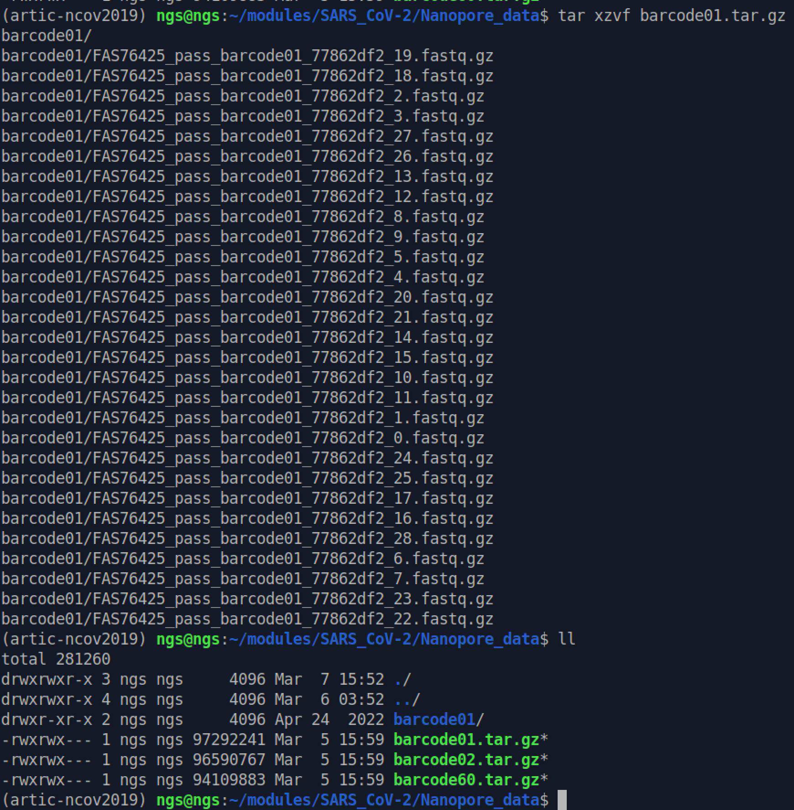

You should see the `barcode01` folder now.

## **Use the `tar` command to uncompress the other two barcode file**
 After, you will have the following three barcode folders:
 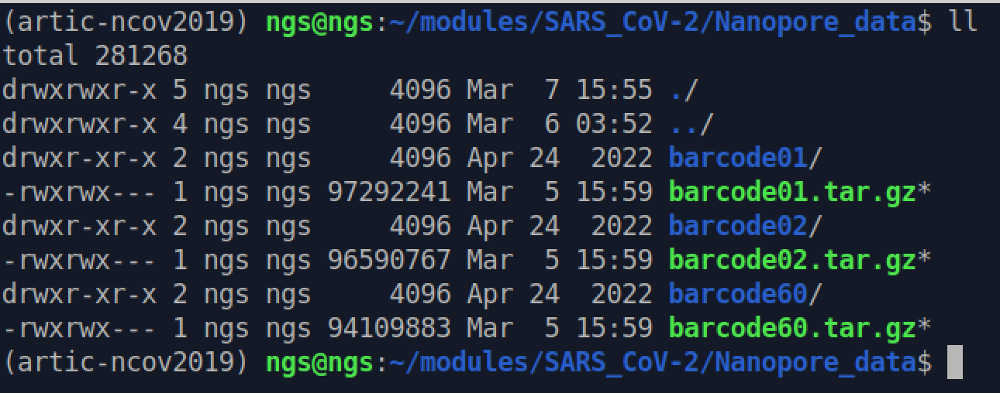


## 3. ARTIC bioinformatics workflow<a name="exercise3"></a>:

We are picking up the protocol at the `guppyplex` command, after the base-calling and demultiplexing steps. Instructions for those are in the SOP :   
https://artic.network/ncov-2019/ncov2019-bioinformatics-sop.html

##### First we make a directory for the output files of the guppyplex command:

```bash
mkdir guppyplex
```
### 1. Run `guppyplex`
`artic guppyplex` combines all the various `.fastq` files into a single on in a given barcode folder and performs initial QC on the reads.   
Now since we are using the Midnight primer set, which has amplicons up to 1200bp, we will run the guppyplex command like so:

```bash
artic guppyplex --skip-quality-check --min-length 250 --max-length 1500 --directory barcode01 --prefix guppyplex/run01
```
`--skip-quality-check` : we are using only the 'passed' reads from the run (high quality) and therefore as per the protocol we can skip this step and speed up the pipeline a bit. You do not have to use this option if you don't want in your real analyses.  
`--min-lenght <value_in_bp>` : the minimum read length used (for traditional ARTIC V4 this is set at 400)  
`--max-lentgth <value_in_bp>`: the maximum read length used (for traditional ARTIC V4 this is set at 700)  
`--directory` : dir name containing the fastq files to process
`--prefix` : a prefix (usually the run name) that is added at the beginning of all fastq files as output. Here we specify the output folder guppyplex and then `run01` as a prefix  


#### **Please run this command for the other two samples (barcodes)**
**Don't** change the `--prefix` option for each sample though! 
______

### 2.  Run `artic minion` pipeline which is the alignment/variant-call/consensus pipeline
We are running the `medaka` pipeline, which only uses the fastq files. The `nanopolish` version of this pipeline uses the raw fast5 output files for variant calling. These fast5 files are very large, which is why we can't use them in our VMs. In general, these pipelines will produce identical results for SARS-CoV-2 data.

```bash
# General usage
artic minion <options> <primer_scheme> <sample>

#Run for run01_barcode1
artic minion --strict --threads 4 --medaka --medaka-model r941_min_high_g360 --scheme-directory artic-ncov2019/primer_schemes --read-file guppyplex/run01_barcode01.fastq nCoV-2019/V1200 run01_barcode01
```
`artic minion`: specifies that the sequencing data is coming from an Oxford Nanopore MinION sequencer.  
`--strict`: indicates that the script should fail if any unexpected parameters or inputs are encountered.  
`--threads 4`: sets the number of CPU threads to be used for the analysis to 4.  
`--medaka`: specifies that consensus sequences should be generated using Medaka.  
`--medaka-model r941_min_high_g360`: specifies the specific Medaka model to be used for consensus calling, in this case r941_min_high_g360  
`--scheme-directory artic-ncov2019/primer_schemes`: specifies the directory containing the ARTIC primer schemes to be used for amplification and sequencing.  
  `--read-file guppyplex/run01_barcode01.fastq`: specifies the path to the input sequencing data file.  
`nCoV-2019/V1200`: specifies the name and path for the output directory that will be created to store the results of the analysis.  
`run01_barcode01`: specifies a prefix to be used for the output files.

A list of all the arguments is here:
| Argument name(s)     | Required | Default value  | Description                                                                                  |
| :------------------- | :------- | :------------- | :------------------------------------------------------------------------------------------- |
| scheme               | Y        | NA             | The name of the primer scheme                                                                |
| sample               | Y        | NA             | The name of the sample                                                                       |
| --medaka             | N        | False          | Use medaka instead of nanopolish for variants                                                |
| --medaka-model       | *        | NA             | Medaka model to use (required if --medaka set)                                               |
| --minimap2           | N        | True           | Use minimap2                                                                                 |
| --bwa                | N        | False          | Use bwa instead of minimap2                                                                  |
| --normalise          | N        | 100            | Normalise down to moderate coverage to save runtime                                          |
| --threads            | N        | 8              | Number of threads                                                                            |
| --scheme-directory   | N        | /artic/schemes | Default scheme directory                                                                     |
| --max-haplotypes     | N        | 1000000        | Max-haplotypes value for nanopolish                                                          |
| --read-file          | N        | NA             | Use alternative FASTA/FASTQ file to <sample>.fasta                                           |
| --fast5-directory    | N        | NA             | FAST5 Directory                                                                              |
| --sequencing-summary | N        | NA             | Path to Guppy sequencing summary                                                             |
| --skip-nanopolish    | N        | False          | Skip nanopolish                                                                              |
| --no-longshot        | N        | False          | Use medaka variant instead of longshot (experimental feautre from v1.2.0)                    |
| --strict             | N        | False          | Enables experimental features (from v1.2.0), including VFC overlap checks and stats          |
| --dry-run            | N        | False          | Perform a dry run of the minion pipeline, outputing commands to a log but not executing them |

More on medaka-models: https://github.com/nanoporetech/medaka#models  
Medaka models are named to indicate i) the pore type, ii) the sequencing device (MinION or PromethION), iii) the basecaller variant, and iv) the basecaller version, with the format:

```
{pore}_{device}_{caller variant}_{caller version}
r941_min_high_g360
```  
In our case we sequenced on Minion/GridION R9.4.1 flowcell using the "high" accuracy base-calling mode and the latest version of guppy that this supports was version 3.6.0.
___
## **! Please amend the command above and run the other two samples through the `artic minion` pipeline**
___
#### There are many output files produced by the pipeline. I will list the most important ones here, but you can find the full description of all files here : https://artic.readthedocs.io/en/latest/minion/

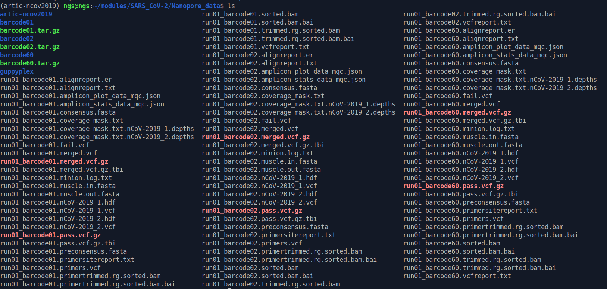

### Output files:

**Mapping files:**

| file name                             | description                                                                          |
| ------------------------------------- | ------------------------------------------------------------------------------------ |
| `$SAMPLE.sorted.bam`                  | the raw alignment of sample reads to reference genome                                |
| `$SAMPLE.trimmed.rg.sorted.bam`       | the post-processed alignment                                                         |
| `$SAMPLE.primertrimmed.rg.sorted.bam` | the post-processed alignment with additional softmasking to exclude primer sequences. *Use this file for reading into Artemis / IGV* |

**Called variants files:**

| file name                | description                                                     |
| ------------------------ | --------------------------------------------------------------- |
| `$SAMPLE.$READGROUP.vcf` | the raw variants detected (one file per primer pool)            |
| `$SAMPLE.merged.vcf`     | the raw variants detected merged into one file                  |
| `$SAMPLE.vcfreport.txt`  | a report evaluating reported variants against the primer scheme |
| `$SAMPLE.fail.vcf`       | variants deemed too low quality                                 |
| `$SAMPLE.pass.vcf.gz`    | detected variants (indexed)                                     |

**Consensus genome files:**

| file name                  | description                                                           |
| -------------------------- | --------------------------------------------------------------------- |
| `$SAMPLE.*_mqc.json`       | stats files which MultiQC can use to make a report                    |
| `$SAMPLE.consensus.fasta`  | the consensus sequence for the input sample                           |
| `$SAMPLE.muscle.out.fasta` | an alignment of the consensus sequence against the reference sequence |


___
## 4. Identify primer dropouts using MultiQC

Once you have run each sample through the `artic minion` pipeline, please run the following:

**Remember the dot at the end of this command**
```bash
conda activate base
multiqc .
```
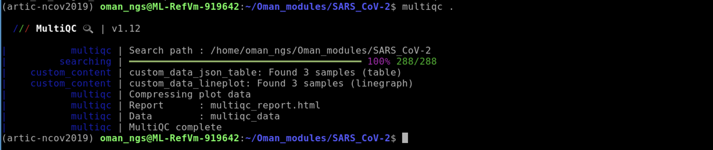

Then run:
```bash
firefox multiqc_report.html
```
### *Questions*
1. Are there any amplicon drop outs in the samples?
2. Which amplicon is it?

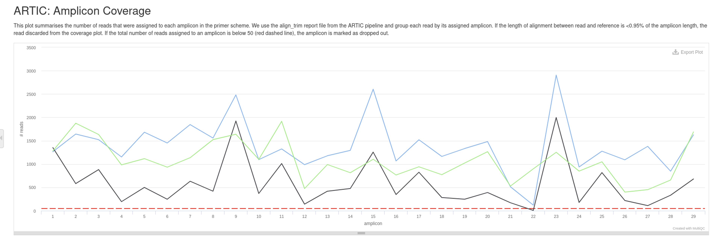

## 5. Use IGV to view mapped reads (bam file) to see why we have a dropout

We have already used Artemis as a genome viewer, but another very popular one is the Integrated Genome Viewer, or IGV, from the Broad Institute.  

Website here : https://igv.org/

I had previously installed `igv` within the `base conda` environment. Therefore you can start IGV like so:

```bash
igv
```
#### First we need to download the SARS-CoV-2 reference<a name="exercise4"></a>
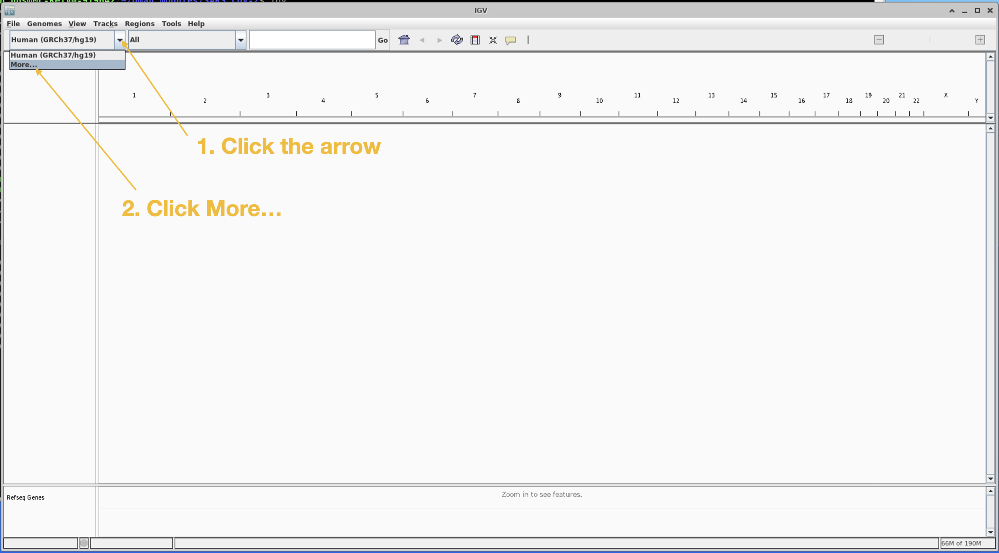

Scroll down the pop-up list until you find SARS-CoV-2. Click SARS-CoV-2 and click OK.
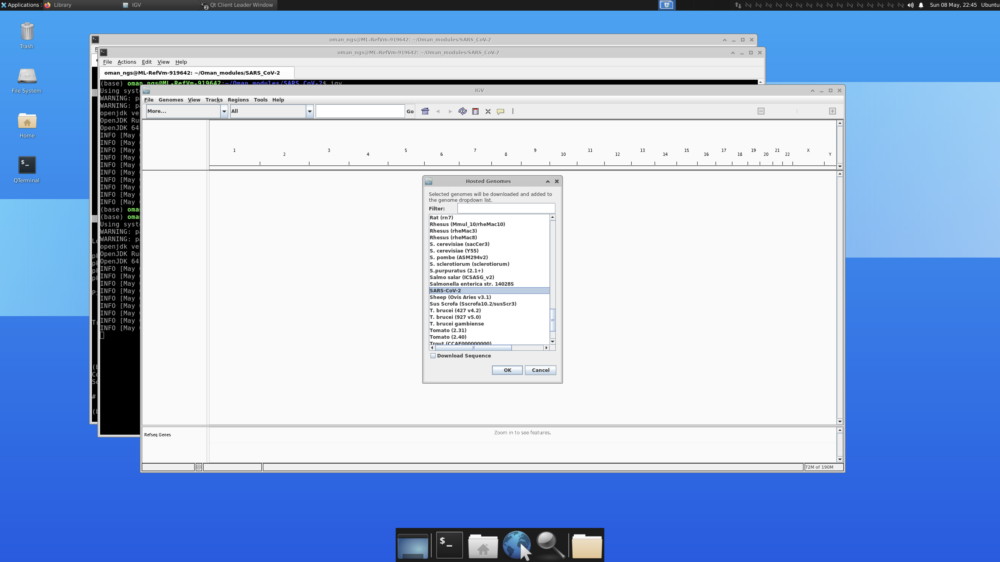

Next we will load in the amplicon are the the primer binding site files.
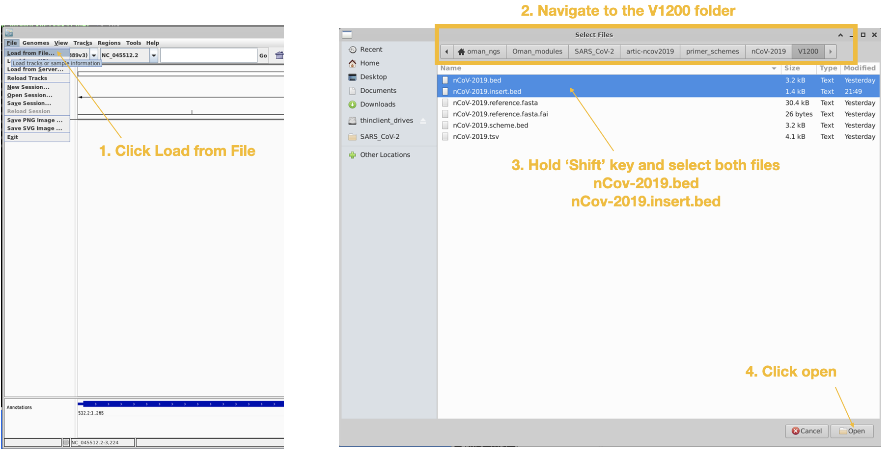

We can view the amplicons easier by changing the view this way:
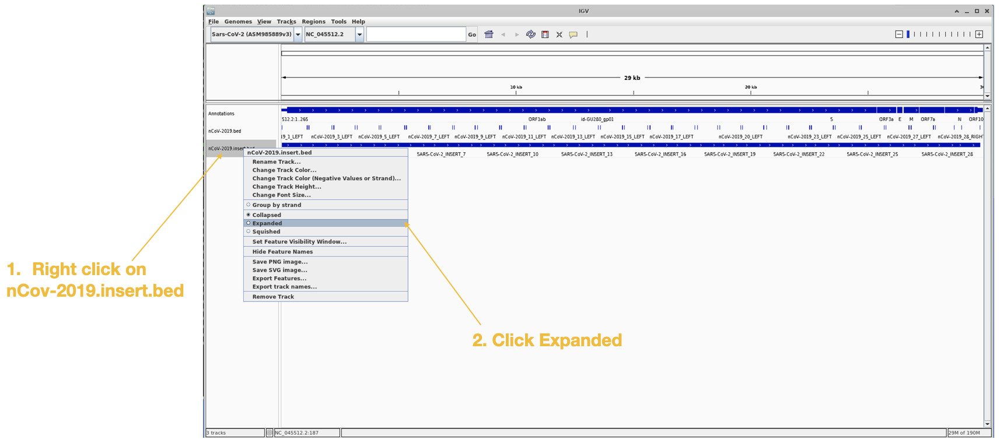

Lastly we will load in the `primertrimmed.rg.sorted.bam` file for barcode02, since that one showed the dropout.
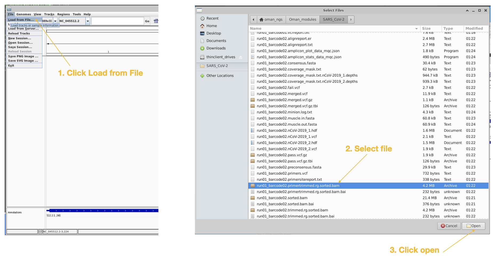

You should now see all the reads being displayed:
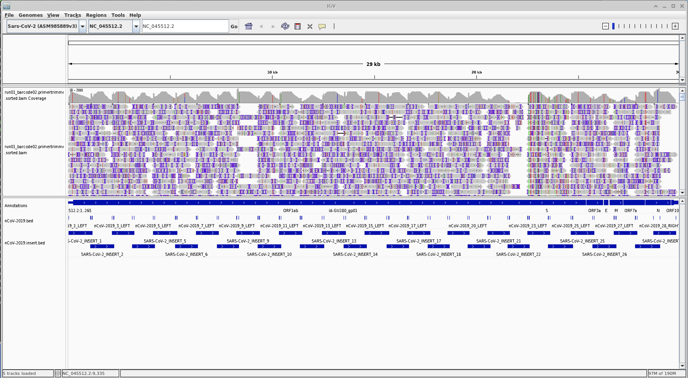

##### Zoom in on amplicon 22

### *Questions*
1. Do you see any mutations occuring in amplicron 22 primer sites?

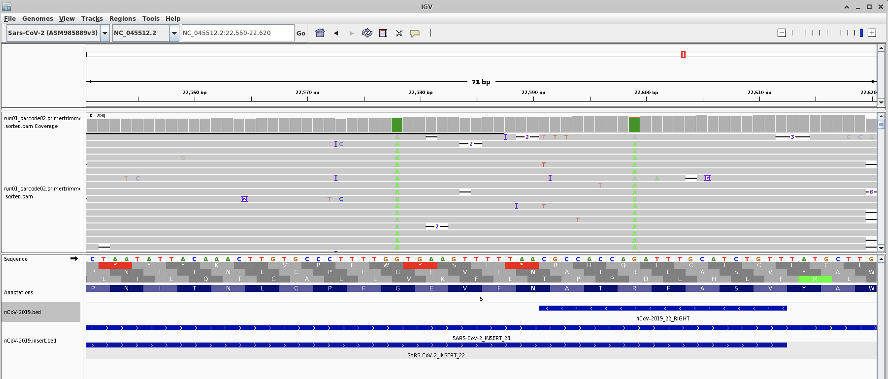
