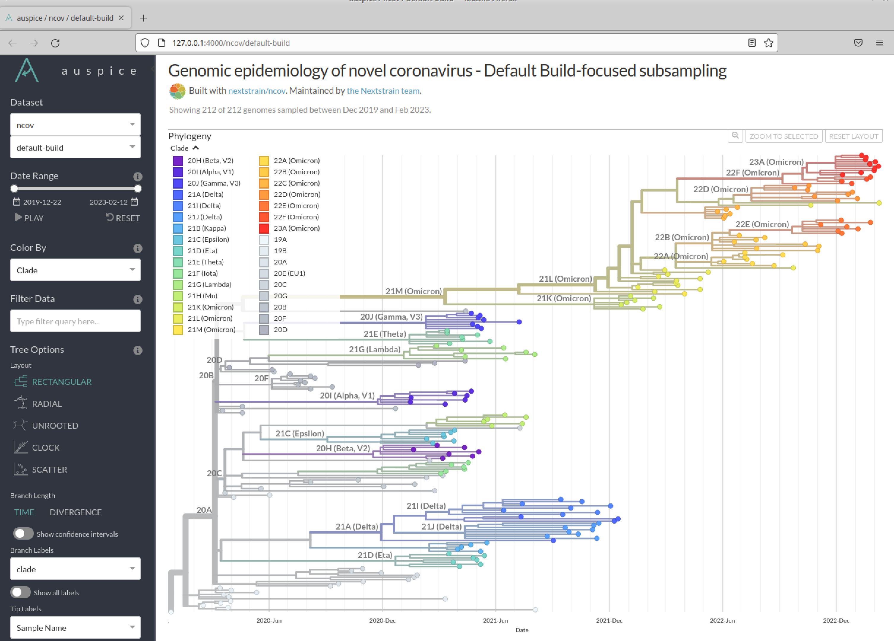
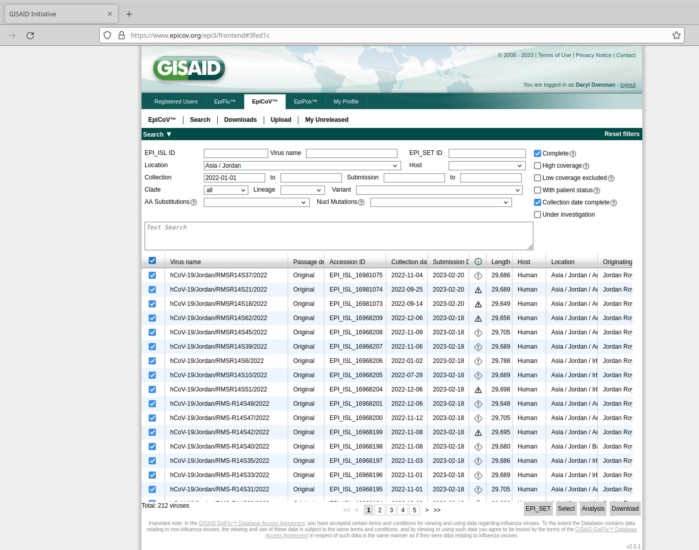
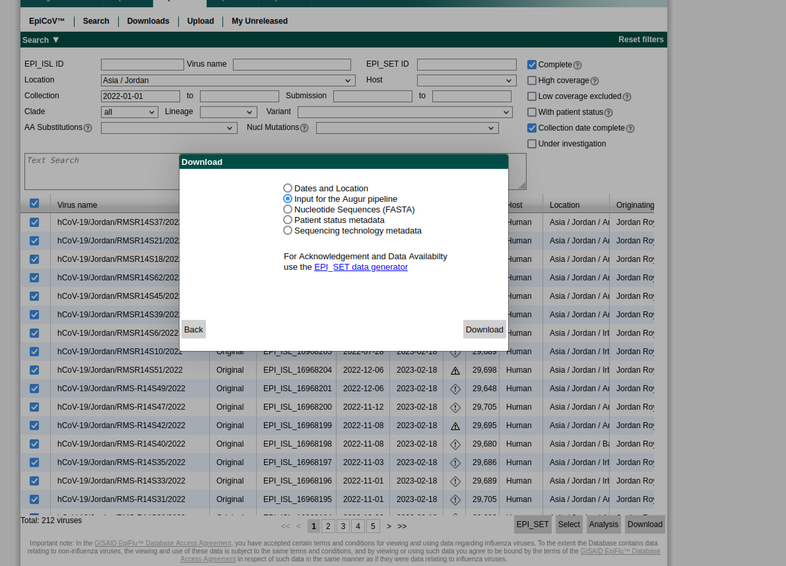
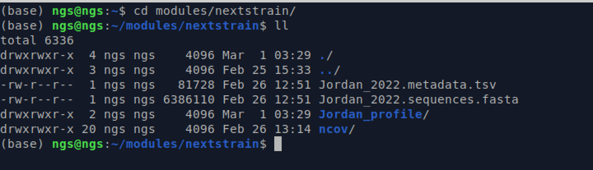
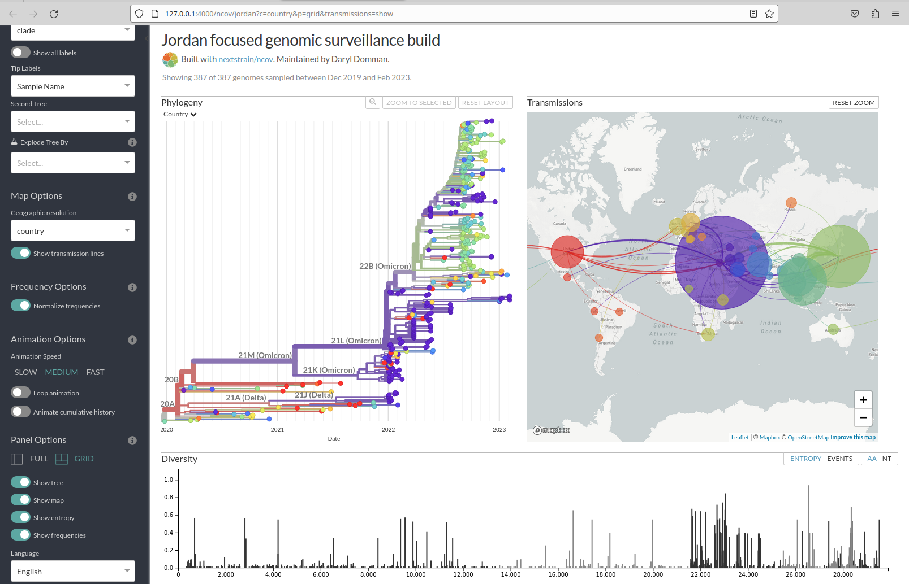

## Table of contents
1. [Introduction & Aims](#introduction)
2. [Example Data](#exercise1)
3. [Jordan Specific Nextstrain build](#exercise2)


## 1. Introduction <a name="introduction"></a>

In this module, are going to explore using the extremely powerful Nextstrain ecosystem.

Nextstrain is an open-source project that uses genomic data to track the evolution and spread of viruses, including SARS-CoV-2. The project combines bioinformatics, data visualization, and epidemiology to provide real-time insights into the genetic diversity, transmission patterns, and geographic distribution of viral populations.

You can read more about Nextstrain and the workflow for SARS-CoV-2 here:  
https://docs.nextstrain.org/projects/ncov/en/latest/index.html 


Navigate to the nextstrain module folder:

```bash
cd modules/nextstrain
```
First we need to use `git` to pull down the Nextstrain specific workflow for running SARS-CoV-2 data. In this case it is the `ncov` workflow.

```bash
git clone https://github.com/nextstrain/ncov.git
```

Now move into that new directory:
```bash
cd ncov
```

## 2. Nextstrain build using example data <a name="exercise1"></a>
We will first go through the process of a nextstrain analysis using a small example dataset provided by the Nextstrain team. 

First let's download the tutorial dataset:
```bash
git clone https://github.com/nextstrain/ncov-tutorial
```
### Run the workflow
```bash
nextstrain build . --configfile ncov-tutorial/example-data.yaml
```

This command tells nextstrain to run the analysis in the current dir ie the dot: `.`   
It also adds a flag to link a configuration file.

You can view the contents of the config file here:

```bash
less ncov-tutorial/example-data.yaml
```
Once completed, you can view the results:
```bash
nextstrain view auspice/
```
This should automatically open a web browser and load the interactive website. 



## 3. Jordan 2022 SARS-CoV-2 dataset<a name="exercise2"></a>  

Here, we are going to be using a dataset downloaded from GISIAD (gisaid.org) that contains all SARS-CoV-2 sequences from Jordan collected in 2022. At the time there were 212 complete genomes with full collection dates (yyyy-mm-dd). 


When downloading from GISAID, you will select the Download button, then select the Augur input option. Currently, GISAID has a limit of 5,000 sequences per download.


You can find the data files from this download here:
```bash
cd ~/modules/nextstrain/
ll
```


Our first task is to move this data into the correct spot for the nextstrain pipeline.
```bash
cp Jordan_2022* ncov/data/.
cp -r Jordan_profile ncov/.
cd ncov
```
Remember `*` means match all after this word, so in this case we can move both files at the same time.

### Nextstrain regional data
What we now need to do is setup the analysis so we can contextualize the Jordan sequences with samples from other countries. Nextstrain allows us to add multiple data inputs, which is very convenient. In our case, we are going to utilize the pre-aligned data that the Nextstrain team provides that utilizes sequence data deposited into NCBI/ENA sequence databases. 

You can view all the files nextstrain provides here:
https://docs.nextstrain.org/projects/ncov/en/latest/reference/remote_inputs.html

Nextstrain provides regional builds (`global`, `africa`, `asia`, `europe`, `north-america`, `oceania` and `south-america`) which contain a subsampled set of approximately 4000 sequences from the last 6 months. They are a good starting point if you are seeking a representative sample of data.

In our case, we are going to utilize the `asia` regional subset for context for the course. In your own analyses you can add more regions or even the full dataset! 

### Set up configuration file
The main file directing nextstrain is the `build.yaml` configuration files.

```yaml
 inputs:
  - name: reference_data
    metadata: https://data.nextstrain.org/files/ncov/open/reference/metadata.tsv.xz
    aligned: https://data.nextstrain.org/files/ncov/open/reference/aligned.fasta.xz
  - name: custom_data
    metadata: data/Jordan_2022.metadata.tsv
    sequences: data/Jordan_2022.sequences.fasta
  - name: background_data
    metadata: https://data.nextstrain.org/files/ncov/open/asia/metadata.tsv.xz
    aligned: https://data.nextstrain.org/files/ncov/open/asia/aligned.fasta.xz

refine:
  root: "Wuhan-Hu-1/2019"

# Define custom auspice configuration to enable frequencies.
files:
  auspice_config: "Jordan_profile/auspice_config.json"

builds:
  jordan:
    title: "Jordan focused genomic surveillance build"
    subsampling_scheme: jordan_scheme

subsampling:
  jordan_scheme: # Name defined above
    custom_sample: # Our Jordan data
      query: --query "(custom_data == 'yes')"
      max_sequences: 300 #max number of Jordan sequences
    jordan_context: # add in regional data
      query: --query "(custom_data != 'yes') & (country != 'Jordan')"
      max_sequences: 300 #max number of regional context sequences
      group_by: division year month
      priorities:
        type: proximity # selects sequences by genetic similarity to Jordan set
        focus: custom_sample
    global_context: # add in global data
      query: --query "(custom_data != 'yes')"
      max_sequences: 200 #max number
      priorities:
        type: proximity
        focus: custom_sample

# Here is where we tell Nextstrain to infer the ancestral traits, in this case geography. This will draw the 'transmission' lines on the map.
traits:
  jordan: #the build name
    sampling_bias_correction: 2.5
    columns: ["country"] # Use country level to draw transmission lines
```
This file can be edited later for your specific needs. For instance, you can add more inputs for more regions or adjust the number of sequences by altering the `max_sequences`. For our course, we set the number of strains to something that will run in just a few minutes. Larger builds can take hours to days to complete.

### Run the Jordan build
```bash
nextstrain build . --configfile Jordan_profile/build.yaml
```
This will take a few minutes to complete.

Once completed, let's visualize the results
```bash
nextstrain view auspice/
```


### *Questions*
1. What do the lines connecting the geographic locations mean? How are they derived?
2. In this example, which countries / regions have are most closely related to the Jordan sequences?
3. What are the predominant lineages circulating?