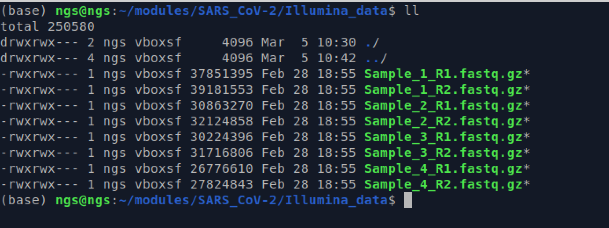
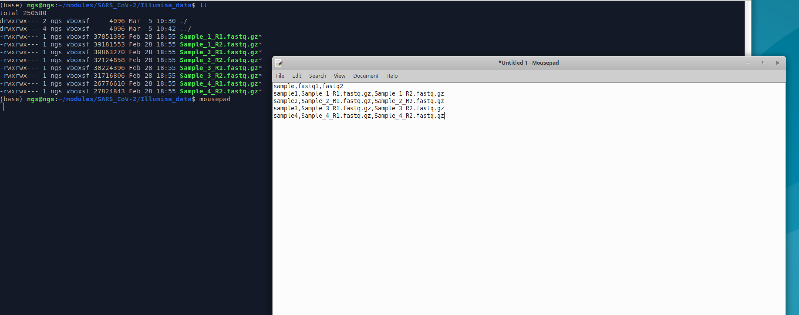
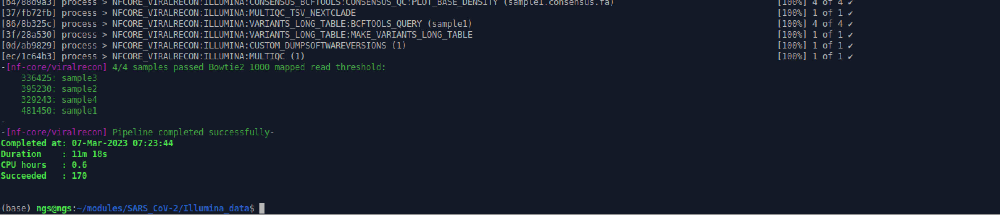
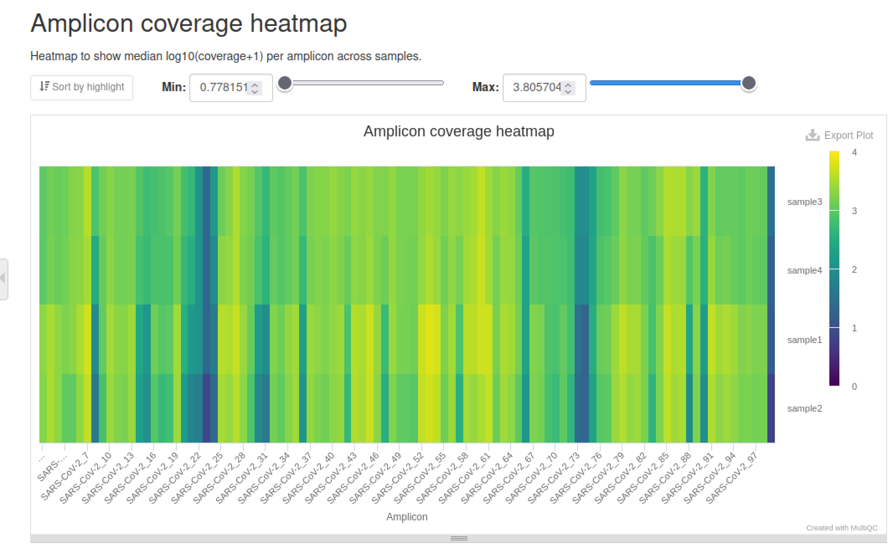
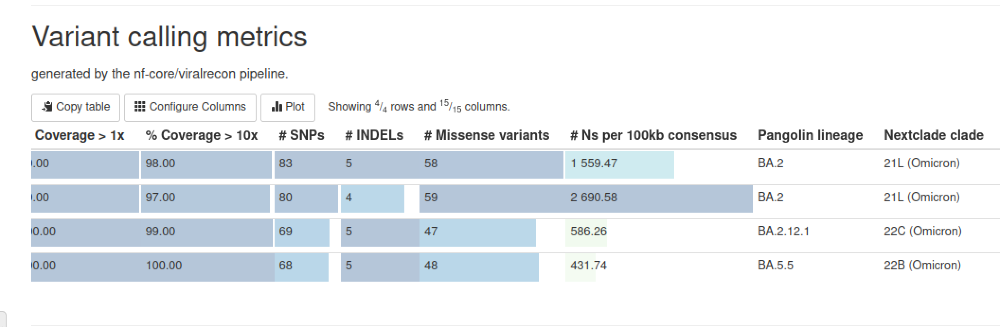
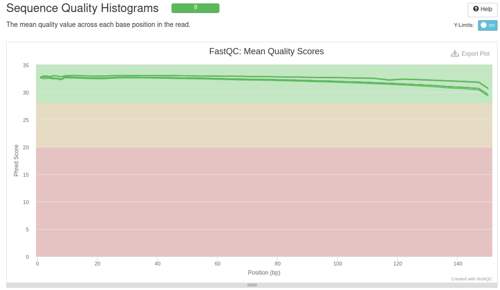
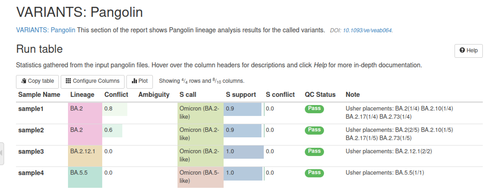
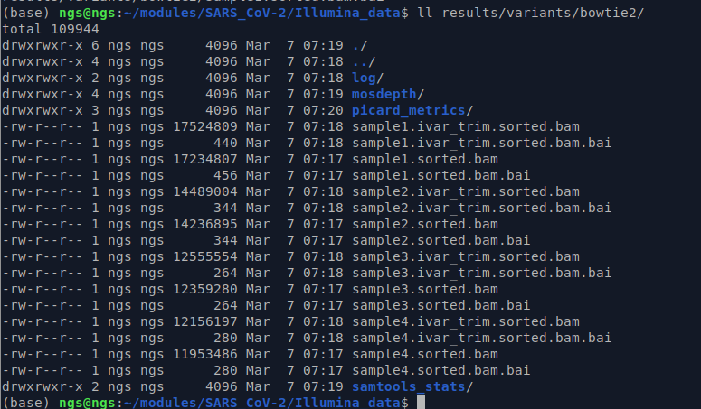
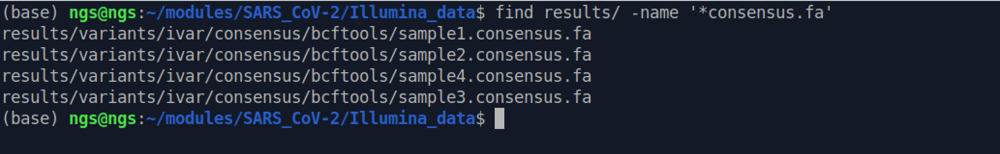
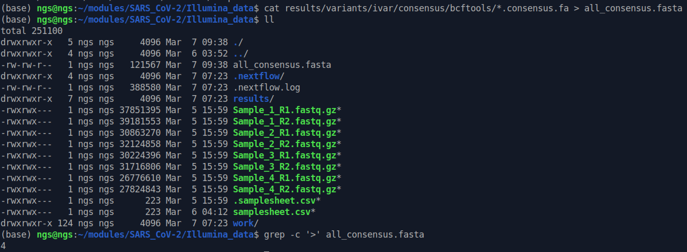

# SARS-CoV-2 Illumina pipeline


## Table of contents
1. [Introduction & Aims](#introduction)
2. [`viralrecon` samplesheet](#exercise1)
3. [Running viralrecon pipeline](#exercise2)
4. [Explore viralrecon output](#exercise3)
5. [Consensus genomes](#exercise4)

## 1. Introduction <a name="introduction"></a>

In this module, we are going to work through how to generate SARS-CoV-2 consensus genomes from  Illumina paired-end data using the `viralrecon` pipeline. 

`Nexflow Viralrecon` is a pipeline for analyzing viral sequences from next-generation sequencing (NGS) data. It is built on the popular workflow management system Nexflow and includes a variety of tools and algorithms for quality control, read trimming, sequence alignment, variant calling, and phylogenetic analysis of viral genomes. In this module, we are going to utilize the SARS-CoV-2 specific `viralrecon` workflow. 

The pipeline is designed to be flexible and customizable, with options to adjust parameters and settings for each step of the analysis. It supports several popular NGS platforms, including Illumina, Nanopore, and PacBio, and can be used for a wide range of viral pathogens, including RNA viruses, DNA viruses, and retroviruses.

You can learn all about the `viralrecon` pipeline here: https://nf-co.re/viralrecon


### We will

- [X] Create the input samplesheet for `viralrecon`
- [X] Run the `viralrecon` pipeline 
- [x] Explore the output files of the pipeline

## 1. Create input samplesheet for pipeline<a name="exercise1"></a>

First let's make sure we are in the right folder:
```bash
cd ~/modules/SARS_CoV-2/Illumina_data
```
 We have provided 4 samples to process:
 ```bash
 ll
 ```
 

 The `viralrecon` pipeline typically uses a sample sheet file to define the samples being analyzed.

 Here is an example of a `viralrecon` sample sheet for SARS-CoV-2 Illumina data:
 ```bash
 sample,fastq1,fastq2
sample1,/path/to/sample1_R1.fastq.gz,/path/to/sample1_R2.fastq.gz
sample2,/path/to/sample2_R1.fastq.gz,/path/to/sample2_R2.fastq.gz
sample3,/path/to/sample3_R1.fastq.gz,/path/to/sample3_R2.fastq.gz
sample4,/path/to/sample4_R1.fastq.gz,/path/to/sample4_R2.fastq.gz
```
`sample`: The name or identifier of the sample being analyzed.  
`fastq1`: The file path or URL of the first paired-end FASTQ file.  
`fastq2`: The file path or URL of the second paired-end FASTQ file.  

**The samplesheet must have the header to be valid!**

Now let's make our samplesheet using the text editor:
```bash
mousepad
```

Save this file as `samplesheet.csv` in our Illumina data folder.

We could have used some command line tricks here to make this file. This would be particularly useful if we have MANY samples to process:

```bash
for i in *_R1.fastq.gz; do prefix=$(basename $i _R1.fastq.gz); echo "$prefix","$prefix"_R1.fastq.gz,"$prefix"_R2.fastq.gz; done
```
See what the output of this command is!

## 2. Run the `viralrecon` pipeline

There are many different parameters and option in this pipeline. You can view all the options here: https://nf-co.re/viralrecon/2.5/parameters


```bash
nextflow run nf-core/viralrecon \
    --input samplesheet.csv \
    --outdir results \
    --platform illumina \
    --protocol amplicon \
    --genome 'MN908947.3' \
    --primer_set artic \
    --primer_set_version 4.1 \
    --skip_asciigenome \
    --skip_assembly \
    --skip_kraken2 \
    -profile docker \
    -resume \
    --max_memory 16.GB \
    --max_cpus 4
```

`--input samplesheet.csv`: specifying the input samplesheet file.  
`--outdir results`: specifying the output directory for the pipeline results.  
`--platform illumina`: specifying the sequencing platform used to generate the data.  
`--protocol amplicon`: specifying the sequencing protocol used to generate the data.  
`--genome 'MN908947.3'`: specifying the reference genome used for mapping and variant calling.   This is the NCBI reference genome accession number for the SARS-CoV-2 genome.  
`--primer_set artic`: specifying the primer set used for amplicon sequencing.  
`--primer_set_version 4.1`: specifying the version of the primer set used.  
`--skip_assembly`: specifying that the pipeline should skip the assembly step, assuming that the input data is already pre-assembled.  
`-profile docker`: specifying that the pipeline should run using Docker.  
`--max_memory 16.GB`: specifying the maximum amount of memory allocated for the pipeline.  
`--max_cpus 4`: specifying the maximum number of CPUs allocated for the pipeline. 

**This pipeline will probably take around 10 minutes to complete - a great time for a break!**

If all went well it should look like this:



## 2. Explore the `viralrecon` output
This will have created a `results` folder (set above with the `--outdir` option). Let's explore!


The primary interactive output file can be viewed in the web browser like so:
```bash
firefox results/multiqc/multiqc_report.html
```
This report file is the interactive summary file that combines all the output into a nice interactive format. Let's examine some of the more important outputs:

### **Looking for primer dropouts in the heatmap plot**

The heatmap shows the coverage of each of the primer sets for each sample. Darker colors mean low coverage, where as the lighter colors mean high coverage. This plot is really important for evaluating how well our amplicon scheme is performing.

### *Questions:*  
1. Do you see any primers sets that are not performing well?
2. Why might this be?

### **Overall sequence metrics**

This table shows many of the most relevant per sequence metrics, including total number of reads, number of mapped reads, the median coverage, and the percent of the reference genome covered at 1X or 10X. It also provides the number os Ns, as well as the Pangolin and Nexclade variant calls.

### **Sequence quality metrics**

There are quite a few plots that we have seen before that relate to our sequencing quality control metrics. In this case -- it looks pretty good!

### **Pangolin lineage calling output**

Here, there is more detail about the pangolin lineage calling.

You can look at what the output categories here: https://cov-lineages.org/resources/pangolin/output.html

### *Questions:*  
1. What does the `Conflict` column mean?
2. Do we have some samples that are difficult to classify?

### **Mapping bam file**
If you ever need to investigate a particular sample, you can find the bam files here, where you can load them into your favorite genome viewer - such as `igv`

```bash
ll results/variants/bowtie2/
```

`sample.sorted.bam`: the orignal mapping file, without primer trimming  
 `sample.ivar_trim.sorted.bam` : mapping file with the primer sites trimmed (usually the file one we need to look at)

## 3. Get the consensus genomes for each sample
Despite all of the pipeline's bells and whistles, it doesn't provide the consensus genomes in an easily accessible way. They are buried down in several results folders. No matter - we can fish them out easily using some command line tricks!

Since we know the output will be have `consensus.fa` for each sample we can use the `find` command to track down these file:
```bash
find results/ -name '*consensus.fa'
```


Now let's use that knowledge to make one fasta file of all our our genomes together:
```bash
cat results/variants/ivar/consensus/bcftools/*.consensus.fa > all_consensus.fasta
```
This will create the new file `all_consensus.fasta` which should have all 4 samples consensus genomes together. 

### *Questions:*  
1. How can we check the number of sequences in the `all_consensus.fasta` ?   
(recall that we can use `grep` to search files.)



This combined file is usually the end point in the pipeline stage. This `all_consensus.fasta` is the file you would use to start the process in uploading the genomes to databases such as GISAID or NCBI. Note you will have to rename the sequence names to match thei database soecific naming conventions, but this is the starting file for all of that process. 