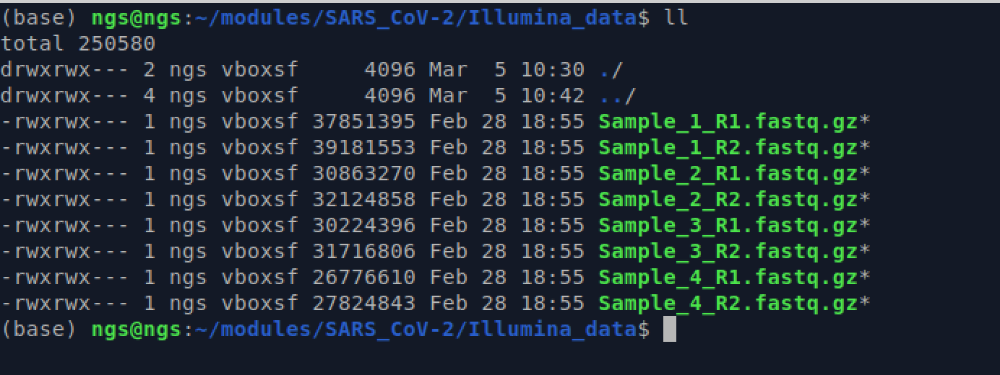

# SARS-CoV-2 mapping and SNP calling


## Table of contents
1. [Introduction & Aims](#introduction)
2. [Use git](#exercise1)
3. [Map reads against reference genoe](#exercise2)
4. [Trim amplicon primers with `ivar`](#exercise3)
5. [Call SNPs](#exercise4)
6. [Create consesnsus fasta genomes](#exercise4)
## 1. Introduction <a name="introduction"></a>

In this module, we are going to work through how to map reads to the SARS-CoV-2 reference genome, call SNPs (variants) and generate consensus genomes. This module will walk you through the individial commands utilizing a variety of tools to go from pair-end Illumina data all the way through generating a conesnsus genome.

While we are focusing on SARS-CoV-2 in this module, the general workflow and tools can be utilized for many viral and bacterial pathogens.


### We will

- [X] Use `git` to clone a repository from GitHub
- [X] Map reads against a reference using `BWA-MEM`
- [x] Trim amplicon primer sequences using `ivar`
- [x] Call variants (SNPs) using `bcftools`
- [x] Create conesnsus genomes in `fasta` format

## 1. Use `git` to pull a repository to your local folder

First let's make sure we are in the right folder:
```bash
cd ~/modules/SARS_CoV-2/Illumina_data

```
 We have provided 4 samples to process:
 ```bash
 ll
 ```
 

## **For this module we are only going to process `Sample_1` and `Sample_2`**

Now we are going to use `git` to pull a folder hosted on GitHub to our local directory. GitHub is where many peeople host code and projects. This is where the ARTIC pipeline repository resides, which is the folder that we are going to download.

```bash
git clone https://github.com/artic-network/artic-ncov2019
```

This command downloads the `artic-ncov2019` folder to our current directory.  

We will be using some of the data within the folder for this module. 


## 2. Map reads against the SARS-CoV-2 reference genomes using `bwa`

1. **Trim and QC the reads**

```bash
trim_galore --cores 4 --paired --fastqc Sample_1_R1.fastq.gz Sample_1_R2.fastq.gz
```

2. **Copy the reference genome**
```
cp artic-ncov2019/primer_schemes/SARS-CoV-2/V4.1/SARS-CoV-2.reference.fasta .
```
This command just copies the reference genome into our current directory to make things easier

3. **Index the reference genome**  
To use BWA to align reads to a reference genome, you must first create an index using the `bwa index` command. The index files must be in the same directory as the reference genome FASTA file for BWA to locate them.
```bash
bwa index SARS-CoV-2.reference.fasta
```

The `bwa index` command creates several files with extensions `.bwt`, `.pac`, `.ann`, `.amb`, and `.sa` that contain different components of the index. 

4. **Map reads to the reference genome** 
In general the `bwa mem` command follows this:
```bash
# General command
bwa mem reference_genome.fasta reads_R1.fastq.gz reads_R2.fastq.gz > output.sam
```
The output of the command is redirected to a SAM file called `output.sam`.  

To map our `Sample_1` reads we do the following:
```bash
# Run bwa for Sample_1
bwa mem -t 4 SARS-CoV-2.reference.fasta Sample_1_R1_val_1.fq.gz Sample_1_R2_val_2.fq.gz > Sample_1.sam
```
`-t`: sets the number of threads to use. Here we use 4  

5. **Sort and convert the `.sam` file to a `.bam` file**
```bash
# General command
samtools sort -o output.sorted.bam input.sam
#Our command for Sample_1
samtools sort -o Sample_1.sorted.bam Sample_1.sam
```
In this command, `input.sam` is the name of the input SAM file, and `output.sorted.bam` is the name of the output sorted BAM file.

Now usually this is where one stops for mapping, but due to how we sequence SARS-CoV-2 using the amplicon approach, we need to ensure that we trim off the primer sequence from our reads.

6. **Trim primer sequences using `ivar`**  
`ivar trim` is used to trim primers from sequencing reads that are generated using amplicon-based methods, such as as we do with SARS-CoV-2.
The tool automatically detects the primers used for amplification in the sequencing reads and removes them from the reads, producing trimmed reads that can be used for downstream analysis such as alignment and variant calling.

**These samples were sequenced using the ARTIC 4.1 primers.**

```bash
# General command
ivar trim -e -i sorted.bam -b primer.bed -p output_prefix

#Our command for Sample_1
ivar trim -e -i Sample_1.sorted.bam -b artic-ncov2019/primer_schemes/SARS-CoV-2/V4.1/SARS-CoV-2.primer.bed -p Sample_1.primertrim
```  
`-i input.fastq.gz`: The input FASTQ file containing the raw sequencing reads in gzipped format.  
`-b primer.bed`: The BED file containing the primer sequences used for amplification. The primer sequences should be specified in the fourth column of the BED file.  
`-p output_prefix`: The prefix for the output files. The tool will generate two output files with the extensions ".trimmed.fastq.gz" and ".trimmed.log".

7. **Sort the `.primertrim.bam` file**
```bash
samtools sort Sample_1.primertrim.bam -o Sample_1.primertrim.sorted.bam
```

# 3. Call variants and create consensus genome
This code performs variant calling and generates a consensus sequence for a sample of SARS-CoV-2 using samtools and ivar.

```bash
samtools mpileup -A -d 6000000 -B -Q 0 --reference SARS-CoV-2.reference.fasta Sample_1.primertrim.sorted.bam | ivar consensus -p Sample_1.consensus -n N
```
The command break down is as follows:
1. `samtools mpileup`: This command generates a pileup format from a sorted BAM file. The options used in this command include:  
`-A`: This option disables base alignment quality adjustment. It is useful when working with reads that have been trimmed or filtered.  
`-d 6000000`: This option sets the maximum depth of coverage to 6,000,000. This is a high value, but it is useful for dealing with regions of the genome that have high coverage.  
`-B`: This option disables probabilistic realignment of reads. It is useful for dealing with short reads that cannot be realigned with high confidence.  
`-Q 0`: This option sets the base quality threshold to 0. This means that all bases will be considered, regardless of their quality score.  
`--reference SARS-CoV-2.reference.fasta`: This option specifies the reference genome used for the alignment.  
`Sample_1.primertrim.sorted.bam`: This is the input BAM file to be processed.  

2. The `|` pipies the output of `samtools mpileip` into the next command `ivar consensus`  

3. `ivar consensus`: This command takes the output of samtools mpileup and generates a consensus sequence using ivar. The options used in this command include:  
`-p Sample_1.consensus`: This option sets the name of the output file.  
`-n N`: This option replaces all positions with low coverage or low quality with an 'N' in the output consensus sequence.

### **Congratulations! You have made your consensus genome for Sample_1!**

# 4. Now repeat the mapping and variant calling steps commands for `Sample_2` ##
You can do it! :)


# 5. Rename and merge the consensus fastas
After you complete the commands for `Sample_2` you will have two `.consensus.fa` files:
```
Sample_1.consensus.fa
Sample_2.consensus.fa
```

Take a look at how `ivar` has named the sample in the fasta headers:
```bash
grep '>' *.consensus.fa
```

They are named with a bunch of stuff:
`Sample_1.consensus.fa:>Consensus_Sample_1.consensus_threshold_0_quality_20`
`Sample_2.consensus.fa:>Consensus_Sample_2.consensus_threshold_0_quality_20`

*Let's fix that!*

```bash
cat Sample_1.consensus.fa | sed 's/Consensus_//' | sed 's/.consensus_threshold_0_quality_20//' > Sample_1_renamed.fasta

cat Sample_2.consensus.fa | sed 's/Consensus_//' | sed 's/.consensus_threshold_0_quality_20//' > Sample_2_renamed.fasta
```
This `sed` command is used to delete the portions of the name we do not want.

Now the samples are just named:
```
Sample_1
Sample_2
```

Now let's merge them together into one file:
```bash
cat *_renamed.fasta > combined_consensus.fasta
```

**Just a bit of housekeeping for large files**  
We don't need the `.sam` files anymore - as the `.bam` are the same files, just compressed. We can save quite a bit of disk space by deleting these files:

```bash
rm *.sam
```


# 6. View the results in Nextclade
Use the web version of NextClade to visualize the results:
https://clades.nextstrain.org/

Drag and drop the `combined_consensus.fasta` file and visualize the results!

**Congratulations! This was quite a bit of work!**